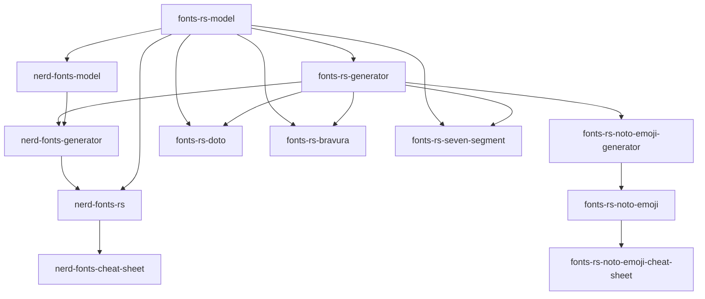
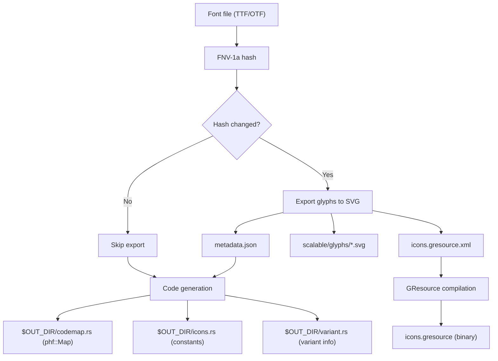
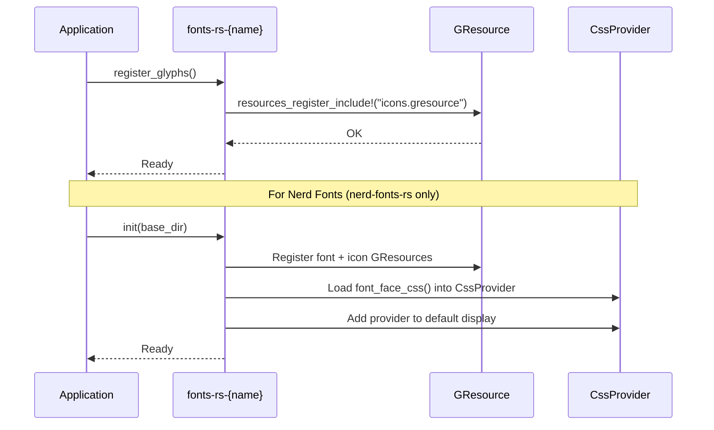

# Architecture

## Workspace Structure

The workspace is organized into 19 crates across three layers:

| Layer | Crates | Role |
|-------|--------|------|
| Generic framework | `fonts-rs-model`, `fonts-rs-generator` | Shared types and build pipeline |
| Font families | `fonts-rs-doto`, `fonts-rs-bravura`, ... (10 crates) | One crate per font family |
| Nerd Fonts | `nerd-fonts-model`, `nerd-fonts-generator`, `nerd-fonts-rs` | Nerd Fonts-specific integration |
| Applications | `nerd-fonts-cheat-sheet`, `fonts-rs-noto-emoji-cheat-sheet` | Demo / cheat sheet apps |

## Crate Dependencies



## Build Pipeline

Each font family crate follows the same build pipeline via `FontBuild`:



### Hash-Based Change Detection

`FontBuild` computes an FNV-1a hash of the font file and stores it in
`resources/.hash`. On subsequent builds, the hash is compared to determine
whether re-export is needed. For variable font variants, `extra_hash()`
adds the variant name to the hash, forcing re-export when the active
variant changes even if the font file is unchanged.

### Code Generation

The default code generation produces three files in `OUT_DIR`:

- **`codemap.rs`** - `phf::Map<char, &str>` (codepoint → glyph name) and
  `phf::Map<&str, char>` (glyph name → codepoint)
- **`icons.rs`** - `pub const` strings for each glyph name
- **`variant.rs`** - `GRESOURCE_PREFIX` and `GLYPH_PREFIX` constants

Custom code generation is available via `FontBuild::run_with()`.

## Font Family Crate Anatomy

Each font family crate has the following structure:

```
crates/fonts-rs-{name}/
├── Cargo.toml          # Features, dependencies, license-file
├── build.rs            # Build pipeline (FontBuild + ExportConfig)
├── resources/
│   ├── {font}.ttf      # Bundled font file
│   ├── {license}.txt   # Font license
│   └── icons.gresource.xml  # Generated by build.rs
└── src/
    ├── lib.rs          # Runtime API (register_glyphs, all_glyphs, GlyphNameExt)
    ├── definition.rs   # FontFamilyConfig implementation
    ├── naming.rs       # FontFamily marker enum + GlyphName<F> type alias
    ├── variant.rs      # include!(OUT_DIR/variant.rs)
    ├── codepoint_map.rs # include!(OUT_DIR/codemap.rs)
    ├── constants.rs    # include!(OUT_DIR/icons.rs)
    └── fonts.rs        # impl_font_loader! (optional, render feature)
```

## Feature Gates

Each font family crate uses feature gates for optional functionality:

| Feature | Description |
|---------|-------------|
| `gtk` (default) | GResource registration, GTK4 icon name resolution |
| `render` | Font loading via `ab_glyph` for software rendering |
| `embed-fonts` | Embed font files via `include_bytes!` instead of disk |
| Variant features | One Cargo feature per font variant (e.g. `bold-dot`) |

## GResource Registration

The `build.rs` script compiles GResource bundles via `glib-build-tools`:

1. **`icons.gresource`** from `resources/icons.gresource.xml` - contains
   all exported SVG glyph files
2. **`font.gresource`** (optional) from `resources/font.gresource.xml` -
   contains the font file itself for GResource-based font loading

At runtime, `register_glyphs()` registers the GResource bundle via
`gio::resources_register_include!("icons.gresource")`.

## Initialization Flow


