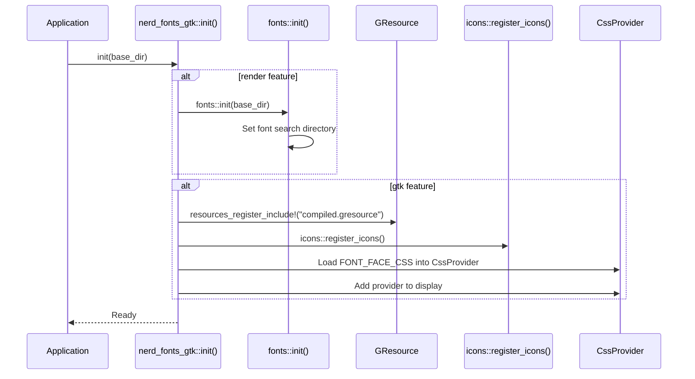
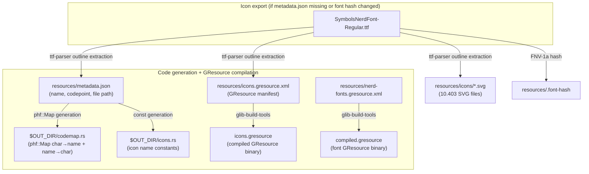

# Architecture

## Module Structure

The crate is organized into modules gated by feature flags:

| Module    | Feature  | Description                                            |
|-----------|----------|--------------------------------------------------------|
| `icons`   | always   | Icon name to Unicode codepoint resolution              |
| `color`   | always   | RGBA color type for rendering and GTK                  |
| `css`     | always   | CSS string constants (GResource prefix, font-face CSS) |
| `gtk`     | `gtk`    | GTK4 icon name resolution and color application        |
| `drawing` | `render` | Software rendering onto pixel buffers                  |
| `fonts`   | `render` | Font loading (TTF and WOFF2) with caching              |
| `web`     | `web`    | Web CSS constant for web instances                     |

## Initialization Flow

## Font Loading Strategy

Fonts can be loaded in two ways:

1. **Embedded** (`embed-fonts` feature) - Font files are compiled into the binary
   via `include_bytes!`. No runtime file access needed.
2. **From disk** (default) - Font files are read from a base directory at runtime.
   The base directory is set via `init(base_dir: Option<&str>)`.

The Nerd Font symbol font (`SymbolsNerdFont-Regular.ttf`) is used for icon
rendering. The label font (`JetBrainsMonoNLNerdFont-Regular.woff2`) is used for
text labels in rendered images.

## GResource Registration

The `build.rs` script compiles two GResource bundles:

1. **`compiled.gresource`** from `resources/nerd-fonts.gresource.xml` — contains
   the Nerd Font TTF files
2. **`icons.gresource`** from `resources/icons.gresource.xml` — contains 10.403
   SVG icon files

At runtime, `init()` registers both bundles via
`gio::resources_register_include!`.

The font GResource contains:

- `SymbolsNerdFont-Regular.ttf` - Nerd Font symbol font
- `SymbolsNerdFontMono-Regular.ttf` - Monospace Nerd Font symbol font

These are referenced by the `@font-face` CSS rules in `FONT_FACE_CSS`.

## Build Pipeline

The build pipeline is fully automated in `build.rs`. Icons are generated from
the bundled font file (~2 seconds) when missing or when the font file has
changed, then phf maps and GResource bundles are compiled:

The generated icon files are in `.gitignore` — they are not checked in.
`build.rs` uses `cargo:rerun-if-changed` to detect when to re-run, plus an
FNV-1a font hash comparison to decide whether the export needs to run. No
manual cleanup is needed when updating the font file. See
[Icon Export](./icon-export.md) for details.
