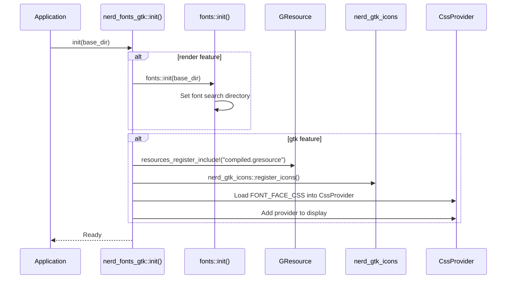

# Architecture

## Module Structure

The crate is organized into modules gated by feature flags:

| Module    | Feature  | Description                                            |
|-----------|----------|--------------------------------------------------------|
| `icons`   | always   | Icon name to Unicode codepoint resolution              |
| `color`   | always   | RGBA color type for rendering and GTK                  |
| `css`     | always   | CSS string constants (GResource prefix, font-face CSS) |
| `gtk`     | `gtk`    | GTK4 icon name resolution and color application        |
| `drawing` | `render` | Software rendering onto pixel buffers                  |
| `fonts`   | `render` | Font loading (TTF and WOFF2) with caching              |
| `web`     | `web`    | Web CSS constant for web instances                     |

## Initialization Flow

## Font Loading Strategy

Fonts can be loaded in two ways:

1. **Embedded** (`embed-fonts` feature) - Font files are compiled into the binary
   via `include_bytes!`. No runtime file access needed.
2. **From disk** (default) - Font files are read from a base directory at runtime.
   The base directory is set via `init(base_dir: Option<&str>)`.

The Nerd Font symbol font (`SymbolsNerdFont-Regular.ttf`) is used for icon
rendering. The label font (`JetBrainsMonoNLNerdFont-Regular.woff2`) is used for
text labels in rendered images.

## GResource Registration

The `build.rs` script compiles `resources/nerd-fonts.gresource.xml` into a
`compiled.gresource` binary using `glib_build_tools::compile_resources`. At
runtime, `init()` registers this binary via
`gio::resources_register_include!("compiled.gresource")`.

The GResource contains:

- `SymbolsNerdFont-Regular.ttf` - Nerd Font symbol font
- `SymbolsNerdFontMono-Regular.ttf` - Monospace Nerd Font symbol font

These are referenced by the `@font-face` CSS rules in `FONT_FACE_CSS`.
