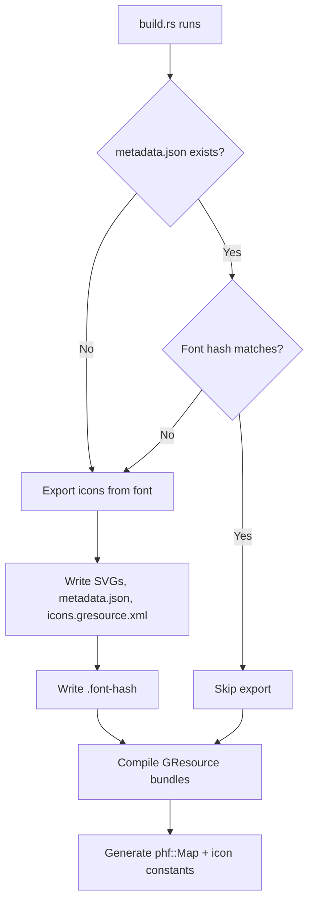

# Icon Export

Nerd Font glyphs are extracted as GTK4 symbolic SVG icons at build time
using [`ttf-parser`](https://crates.io/crates/ttf-parser). The export logic
lives in `src/icons/export.rs` and is called automatically by `build.rs`.

## Automatic Generation

`build.rs` generates the icon resources on demand. The export is triggered
when `resources/metadata.json` does not exist (e.g. on a fresh clone) **or**
when the font file has changed since the last export:



```
resources/NerdFontsSymbolsOnly/SymbolsNerdFont-Regular.ttf
  ↓  build.rs (ttf-parser outline extraction, ~2s)
resources/icons/*.svg          (10.403 SVG files)
resources/metadata.json        (name, codepoint, file path)
resources/icons.gresource.xml  (GResource manifest)
resources/.font-hash           (FNV-1a hash of font file)
  ↓  build.rs (code generation)
$OUT_DIR/codemap.rs            (phf::Map<char, &str> + phf::Map<&str, char>)
$OUT_DIR/icons.rs              (icon name constants)
  ↓  build.rs (glib-build-tools)
compiled.gresource             (font GResource bundle)
icons.gresource                (icon GResource bundle)
```

The generated files (`resources/icons/`, `resources/metadata.json`,
`resources/icons.gresource.xml`, `resources/.font-hash`) are in `.gitignore`
and not checked into the repository. They are regenerated from the font file
as needed.

### Caching

`build.rs` uses two mechanisms for caching:

**Cargo rebuild triggers** (`cargo:rerun-if-changed`):

- `resources/NerdFontsSymbolsOnly/SymbolsNerdFont-Regular.ttf` — triggers
  `build.rs` re-execution
- `resources/metadata.json` — triggers phf::Map regeneration
- `resources/icons.gresource.xml` — triggers GResource recompilation
- `resources/nerd-fonts.gresource.xml` — triggers font GResource recompilation
- `build.rs` — triggers full rebuild

**Font hash comparison** (FNV-1a):

When `build.rs` runs, it computes an FNV-1a hash of the font file and compares
it against the stored hash in `resources/.font-hash`. If the hashes differ
(or the file is missing), the full icon export is triggered. Otherwise the
export is skipped.

This means:

- **Fresh clone**: `metadata.json` missing → export runs (~2 seconds)
- **Font updated**: hash differs → export runs automatically
- **No changes**: hash matches → export skipped (fast incremental build)
- **Deleted generated files**: `metadata.json` missing → export runs

No manual `rm -rf` or `cargo clean` is needed when updating the font file.

## CLI Binary

The `export_icons` binary provides a command-line interface to the same
export logic. It requires the `export` feature:

```sh
cargo run --features export --bin export_icons -- <font.ttf> -o <output_dir>/
```

For example, to export from the bundled Symbols Nerd Font to a custom
directory:

```sh
cargo run --features export --bin export_icons -- \
    resources/NerdFontsSymbolsOnly/SymbolsNerdFont-Regular.ttf \
    -o /tmp/my-icons/
```

## Library API

The export functionality is available as a public API for library users
who want to generate SVG icons programmatically:

```rust,ignore
use nerd_fonts_gtk::icons::export;

let count = export::export_icons(
    std::path::Path::new("font.ttf"),
    std::path::Path::new("output/"),
).expect("Failed to export icons");

println!("Exported {} icons", count);
```

This requires the `export` feature:

```toml
[dependencies]
nerd-fonts-gtk = { version = "0.1", features = ["export"] }
```

## How It Works

### Glyph Outline Extraction

The export uses `ttf_parser::Face::outline_glyph()` with a custom
`OutlineBuilder` implementation that converts Bezier curve commands
directly into SVG path data:

| OutlineBuilder method | SVG path command |
|-----------------------|------------------|
| `move_to(x, y)`       | `M x y`          |
| `line_to(x, y)`       | `L x y`          |
| `quad_to(x1, y1, x, y)` | `Q x1 y1 x y`  |
| `curve_to(x1, y1, x2, y2, x, y)` | `C x1 y1 x2 y2 x y` |
| `close()`             | `Z`              |

Both TrueType (`glyf`) and OpenType/CFF outlines are supported transparently
by `ttf-parser`.

### Codepoint Resolution

Nerd Fonts use codepoints across multiple Unicode ranges:

- **BMP PUA**: U+E000–U+F8FF (most icons)
- **Miscellaneous Technical**: U+23FB–U+23FE (IEC power symbols)
- **Miscellaneous Symbols and Arrows**: U+2B58
- **Supplementary PUA**: U+F0001–U+10FFFF

The export builds a reverse character map (GlyphId → char) by probing all BMP
codepoints (U+0000–U+FFFF) plus the supplementary PUA. This takes ~17ms total
at ~16ns per `glyph_index()` lookup.

### Name Normalization

Glyph names from the font's `post`/`CFF` tables are normalized to GTK-friendly
icon names:

1. Lowercase
2. Replace `_` with `-`
3. Replace non-alphanumeric characters (except `-`) with `-`
4. Collapse consecutive `-`
5. Strip leading/trailing `-`
6. Prefix with `nf-` and suffix with `-symbolic`

Example: `uniF11B` → `nf-f11b-symbolic`

### Empty Glyphs

Some glyphs (e.g. `nonmarkingreturn`, `blank`) have no outline data. These
are exported as minimal empty SVGs so their icon names remain registered in
`metadata.json`.

## Feature Gate

The `export` feature enables `ttf-parser`, `clap`, `serde`, and `serde_json`
as runtime dependencies for the library API and CLI binary. It is not enabled
by default to keep the dependency tree minimal.

`ttf-parser` is also a build-dependency (always present) so that `build.rs`
can run the export without the `export` feature being enabled.

```toml
[features]
export = ["dep:ttf-parser", "dep:clap", "dep:serde", "dep:serde_json"]
```
