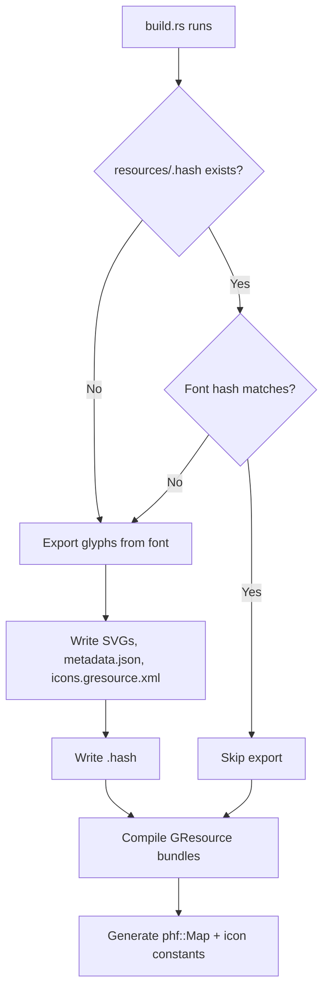

# Glyph Export

Glyphs are extracted as GTK4 symbolic SVG icons at build time using
[`skrifa`](https://crates.io/crates/skrifa) for outline parsing. The export
logic lives in the `fonts-rs-generator` crate and is called automatically by
each font family crate's `build.rs`.

## Automatic Generation

`build.rs` generates the icon resources on demand via `FontBuild`. The export
is triggered when the font file hash has changed since the last export:



```
resources/{font}.ttf
  ↓  build.rs (skrifa outline extraction, via ExportConfig)
resources/scalable/glyphs/*.svg   (SVG files)
resources/metadata.json           (name, codepoint, file path)
resources/icons.gresource.xml     (GResource manifest)
resources/.hash                   (FNV-1a hash of font file)
  ↓  build.rs (code generation via FontBuild)
$OUT_DIR/codemap.rs               (phf::Map<char, &str> + phf::Map<&str, char>)
$OUT_DIR/icons.rs                 (icon name constants)
$OUT_DIR/variant.rs               (GRESOURCE_PREFIX + GLYPH_PREFIX)
  ↓  build.rs (glib-build-tools)
icons.gresource                   (icon GResource bundle)
```

The generated files (`scalable/`, `metadata.json`, `icons.gresource.xml`,
`.hash`) are in `.gitignore` and not checked into the repository. They are
regenerated from the font file as needed.

### Caching

`FontBuild` uses two mechanisms for caching:

**Cargo rebuild triggers** (`cargo:rerun-if-changed`):
- The font file - triggers `build.rs` re-execution
- `resources/metadata.json` - triggers phf::Map regeneration
- `resources/icons.gresource.xml` - triggers GResource recompilation
- `build.rs` - triggers full rebuild

**Font hash comparison** (FNV-1a):
When `build.rs` runs, it computes an FNV-1a hash of the font file and compares
it against the stored hash in `resources/.hash`. If the hashes differ (or the
file is missing), the full glyph export is triggered. Otherwise the export is
skipped.

For variable font variants, `extra_hash()` adds the variant name to the
hash, forcing re-export when the active variant changes even if the font file
is unchanged.

This means:
- **Fresh clone**: hash missing → export runs
- **Font updated**: hash differs → export runs automatically
- **No changes**: hash matches → export skipped (fast incremental build)
- **Variant changed**: extra hash differs → export runs

No manual `rm -rf` or `cargo clean` is needed when updating the font file.

## Two Export Methods

### `ExportConfig::export_glyphs` (struct method)

Used by most font family crates. Normalizes glyph names to
`{glyph_name_prefix}-{kebab}` and renders SVGs with the configured axis
location. Supports `name_filter` for custom glyph filtering.

```rust
let config = ExportConfig::<DotoConfig>::with_variant(*entry);

FontBuild::new(&font_path)
    .extra_hash(entry.as_str())
    .run(|font_path, resources_dir| config.export_glyphs(font_path, resources_dir))
    .map_err(|e| miette::miette!("{e}"))?;
```

### `ExportConfig::export_glyphs_by_name_map` (struct method)

Used by fonts without PostScript glyph names (e.g. SMuFL fonts with `post`
table version 3.0). Glyph names come from an external metadata file parsed
into a `GlyphNameMap`.

```rust
let name_map: GlyphNameMap = serde_json::from_str(&glyphnames_json)?;
let config = ExportConfig::<BravuraConfig>::new();

FontBuild::new(&font_path)
    .run(|font_path, resources_dir| {
        config.export_glyphs_by_name_map(font_path, resources_dir, &name_map)
    })
    .map_err(|e| miette::miette!("{e}"))?;
```

### `FontDefinition::export_glyphs` (trait default method)

Used by font families with semantic PostScript glyph names (e.g. Barcode,
Seven-Segment). Uses `Self::normalize_name` for type-safe glyph names and
renders SVGs at the default axis location.

## How It Works

### Glyph Outline Extraction

The export uses `skrifa` to parse font outlines and convert Bezier curve
commands directly into SVG path data:

| OutlineBuilder method            | SVG path command    |
|----------------------------------|---------------------|
| `move_to(x, y)`                  | `M x y`             |
| `line_to(x, y)`                  | `L x y`             |
| `quad_to(x1, y1, x, y)`          | `Q x1 y1 x y`       |
| `curve_to(x1, y1, x2, y2, x, y)` | `C x1 y1 x2 y2 x y` |
| `close()`                        | `Z`                 |

Both TrueType (`glyf`) and OpenType/CFF outlines are supported transparently
by `skrifa`.

### Codepoint Resolution

The export builds a reverse character map (GlyphId → char) by probing
codepoints in the ranges defined by `FontFamilyConfig::CODEPOINT_RANGES`:

- `BMP_RANGE` - `U+0000`–`U+FFFF` (default, most fonts)
- `ASCII_PRINTABLE_RANGE` - `U+0020`–`U+007E` (barcode, segment fonts)
- `PUA_RANGE` - `U+E000`–`U+F8FF` (icon fonts, SMuFL)
- `SUPPLEMENTARY_PUA_RANGE` - `U+F0001`–`U+10FFFF` (Nerd Fonts)

### Name Normalization

Glyph names from the font's `post`/`CFF` tables are normalized to
GTK-friendly icon names:

1. Lowercase
2. Replace `_` with `-`
3. Replace non-alphanumeric characters (except `-`) with `-`
4. Collapse consecutive `-`
5. Strip leading/trailing `-`
6. Prefix with `{glyph_name_prefix}-` (e.g. `doto-`, `dseg7-`)

For Nerd Fonts, the prefix is `nf-` and the suffix `-symbolic` is added.

### Empty Glyphs

Some glyphs (e.g. `nonmarkingreturn`, `blank`) have no outline data. These
are exported as minimal empty SVGs so their icon names remain registered in
`metadata.json`.

## Crate Structure

The export logic lives in the `fonts-rs-generator` crate:

```toml
# Font family crate's Cargo.toml (build-dependency)
[build-dependencies]
fonts-rs-generator.workspace = true
fonts-rs-model.workspace = true
miette.workspace = true
```

See [Build Patterns](./build-patterns.md) for complete `build.rs` examples.
