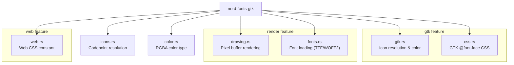

# Introduction

**nerd-fonts-gtk** is a Rust library for integrating [Nerd Fonts](https://www.nerdfonts.com/)
into GTK4 projects. It provides icon name resolution, font loading, software rendering,
and CSS generation for Nerd Font symbols.

## What Are Nerd Fonts?

[Nerd Fonts](https://www.nerdfonts.com/) are developer-targeted fonts that patch
popular programming fonts with thousands of iconic glyphs. They are commonly used in
terminals, editors, and development tools to display file-type icons, Git status
symbols, and other developer-oriented pictograms.

## Features

- **Icon Name Resolution** - Map human-readable names like `nf-fa-gamepad` to
  Unicode codepoints via the `nerd_gtk_icons` codepoint map
- **GTK4 Integration** - Register GResource fonts, apply icon colors to
  `gtk4::Image` and `gtk4::Label` widgets via display-scoped CSS providers
- **Software Rendering** - Draw Nerd Font icons, text labels, progress bars, and
  icon grids onto raw RGBA pixel buffers using `ab_glyph` (no GTK required)
- **CSS Generation** - GTK `@font-face` CSS and web CSS with per-icon
  `content: "\XXXX"` mappings
- **Feature Gates** - Use only what you need: `gtk`, `render`, `web`, `embed-fonts`

## Module Overview

## License

MIT. See [LICENSE](https://github.com/smearor/nerd-fonts-gtk/blob/main/LICENSE).
