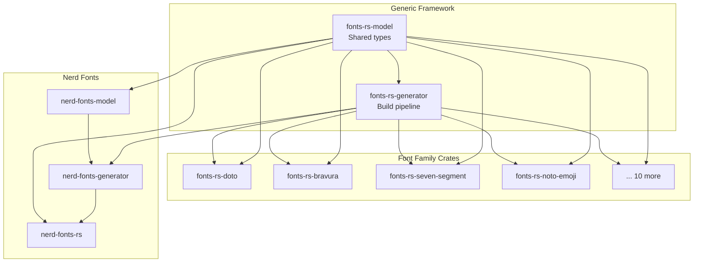

# Introduction

**fonts-rs** is a Rust workspace for integrating font families into GTK4
projects. It provides a modular framework for exporting glyphs as SVG icons,
generating GResource bundles, resolving icon names to Unicode codepoints, and
rendering text with software rasterization.

## Architecture Overview

The workspace is organized into three layers:

1. **Generic framework** - `fonts-rs-model` (shared types) and
   `fonts-rs-generator` (build-time pipeline)
2. **Font family crates** - one crate per font family (e.g. `fonts-rs-doto`,
   `fonts-rs-bravura`, `fonts-rs-seven-segment`)
3. **Nerd Fonts integration** - `nerd-fonts-model`, `nerd-fonts-generator`,
   and `nerd-fonts-rs` for the legacy Nerd Fonts-specific API

## Features

- **Modular font family crates** - each font family is a separate crate with
  its own build script, GResource bundle, and runtime API
- **Type-safe glyph names** - `GlyphName<F>` phantom typing prevents
  mix-ups between font families at compile time
- **Variable font support** - variants via Cargo features with axis-based
  rendering (e.g. weight, roundness)
- **GTK4 integration** - GResource registration, icon name resolution, CSS
  providers
- **Software rendering** - font loading via `ab_glyph` for headless rendering
  (see [`pixel-drawing`](https://github.com/smearor/pixel-drawing))
- **Build-time code generation** - `phf::Map` codepoint maps, Rust constants,
  and GResource XML generated from font files
- **Metadata generation** - keywords, categories, and aliases for search
  functionality (e.g. Noto Emoji CLDR annotations)

## Available Font Families

| Crate | Font | License | Variants |
|-------|------|---------|----------|
| `fonts-rs-doto` | Doto | OFL-1.1 | Variable (wght, ROND) |
| `fonts-rs-seven-segment` | DSEG7 | OFL-1.1 | Multiple files |
| `fonts-rs-fourteen-segment` | DSEG14 | OFL-1.1 | Multiple files |
| `fonts-rs-barcode-code39` | Lib Barcode 39 | OFL-1.1 | - |
| `fonts-rs-barcode-code128` | Lib Barcode 128 | OFL-1.1 | - |
| `fonts-rs-barcode-ean13` | Lib Barcode EAN13 | OFL-1.1 | - |
| `fonts-rs-bravura` | Bravura | OFL-1.1 | - |
| `fonts-rs-redacted` | Redacted | OFL-1.1 | - |
| `fonts-rs-dicefont` | DiceFont | OFL-1.1 | - |
| `fonts-rs-cuernavaca` | Cuernavaca | OFL-1.1 | - |
| `fonts-rs-noto-emoji` | Noto Emoji | OFL-1.1 | - |
| `nerd-fonts-rs` | Nerd Fonts | MIT | - |

## License

MIT for framework code. Font files retain their original licenses (OFL-1.1
for most fonts, MIT for Nerd Fonts). See [LICENSE](https://github.com/smearor/fonts-rs/blob/main/LICENSE).
