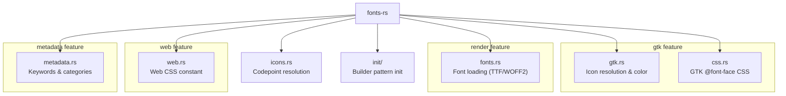

# Introduction

**fonts-rs** is a Rust library for integrating [Nerd Fonts](https://www.nerdfonts.com/)
into GTK4 projects. It provides icon name resolution, font loading, software rendering,
and CSS generation for Nerd Font symbols.

## What Are Nerd Fonts?

[Nerd Fonts](https://www.nerdfonts.com/) are developer-targeted fonts that patch
popular programming fonts with thousands of iconic glyphs. They are commonly used in
terminals, editors, and development tools to display file-type icons, Git status
symbols, and other developer-oriented pictograms.

## Features

- **Icon Name Resolution** - Map human-readable names like `nf-fa-gamepad` to
  Unicode codepoints via the vendored codepoint map
- **GTK4 Integration** - Register GResource fonts, apply icon colors to
  `gtk4::Image` and `gtk4::Label` widgets via display-scoped CSS providers
- **Font Loading** - Load Nerd Font TTF/WOFF2 files for software rendering
  via `ab_glyph` (no GTK required, see [`pixel-drawing`](https://github.com/smearor/pixel-drawing) for rendering)
- **CSS Generation** - GTK `@font-face` CSS and web CSS with per-icon
  `content: "\XXXX"` mappings
- **Feature Gates** - Use only what you need: `gtk`, `v4_12`, `render`, `web`, `embed-fonts`, `metadata`

## Module Overview

## License

MIT. See [LICENSE](https://github.com/smearor/fonts-rs/blob/main/LICENSE).
