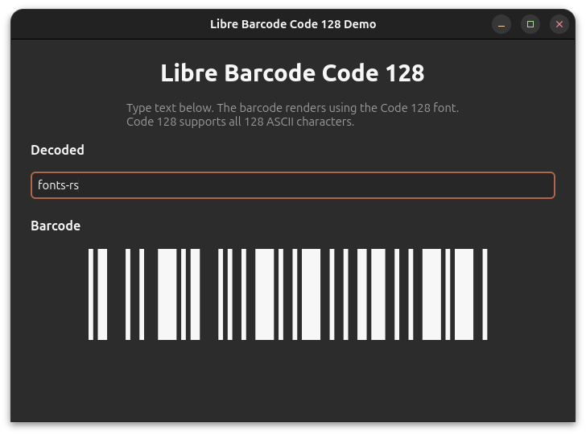

# fonts-rs-barcode-code128

Libre Barcode Code 128 font integration for GTK 4 and pixel-drawing.

## Overview

[Libre Barcode 128](https://github.com/graphicore/librebarcode) is a barcode
font for the Code 128 symbology. This crate integrates it into the
`fonts-rs` framework.



## Features

- **`gtk`** (default) - GResource registration and GTK4 icon name resolution
- **`render`** - Font loading via `ab_glyph` for software rendering
- **`embed-fonts`** - Embed font file via `include_bytes!`

## Usage

```toml
[dependencies]
fonts-rs-barcode-code128 = "0.1"
```

```rust
use fonts_rs_barcode_code128::register_glyphs;

fn main() {
    register_glyphs().unwrap();
}
```

## Font License

Libre Barcode is licensed under the SIL Open Font License (OFL-1.1). The
crate code is MIT.
