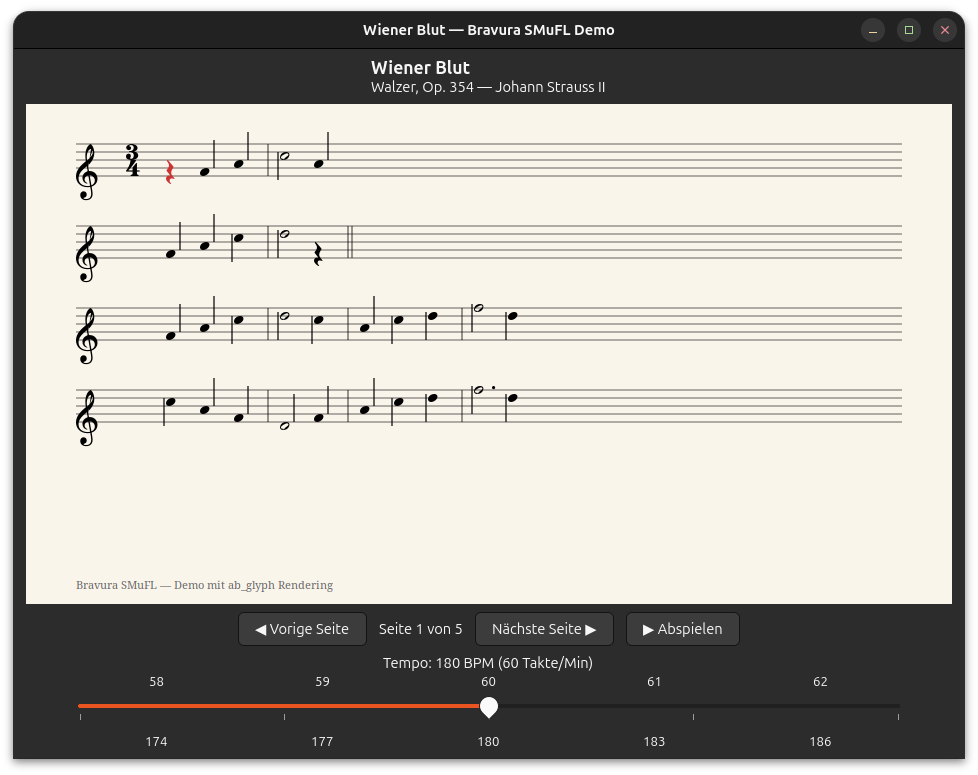

# fonts-rs-bravura

Bravura SMuFL music notation font integration for GTK 4 and pixel-drawing.

## Overview

[Bravura](https://github.com/steinbergmedia/bravura) is a SMuFL-compliant
music notation font. This crate integrates Bravura into the `fonts-rs`
framework, using the SMuFL `glyphnames.json` metadata for glyph name
resolution (since Bravura lacks PostScript glyph names).



## Features

- **`gtk`** (default) - GResource registration and GTK4 icon name resolution
- **`render`** - Font loading via `ab_glyph` for software rendering
- **`embed-fonts`** - Embed font file via `include_bytes!`

## Usage

```toml
[dependencies]
fonts-rs-bravura = "0.1"
```

```rust
use fonts_rs_bravura::register_glyphs;

fn main() {
    register_glyphs().unwrap();
}
```

## Font License

Bravura is licensed under the SIL Open Font License (OFL-1.1). The crate
code is MIT.
