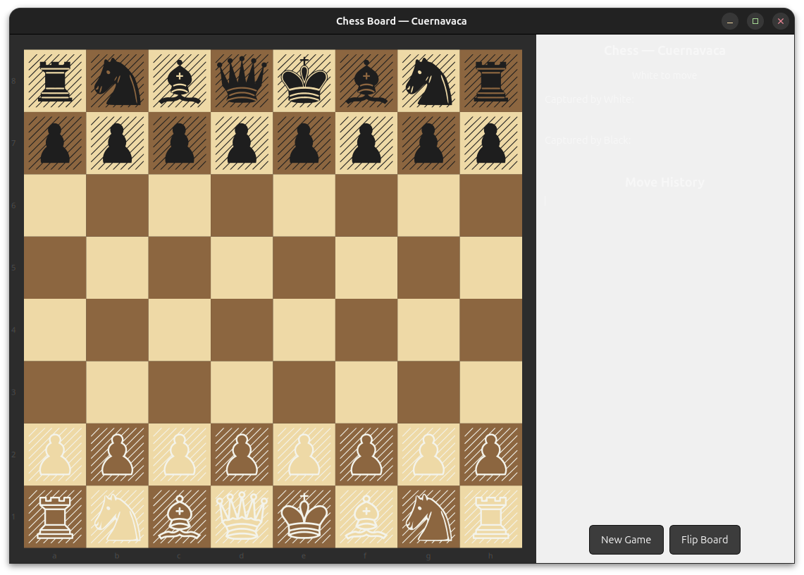

# fonts-rs-cuernavaca

Chess Cuernavaca font integration for GTK 4 and pixel-drawing.

## Overview

[Cuernavaca](https://github.com/benjaminmgross/cuernavaca) is a chess font
containing figurine glyphs for chess pieces. This crate integrates Cuernavaca
into the `fonts-rs` framework.



## Features

- **`gtk`** (default) - GResource registration and GTK4 icon name resolution
- **`render`** - Font loading via `ab_glyph` for software rendering
- **`embed-fonts`** - Embed font file via `include_bytes!`

## Usage

```toml
[dependencies]
fonts-rs-cuernavaca = "0.1"
```

```rust
use fonts_rs_cuernavaca::register_glyphs;

fn main() {
    register_glyphs().unwrap();
}
```

## Font License

Cuernavaca is licensed under the SIL Open Font License (OFL-1.1). The crate
code is MIT.
