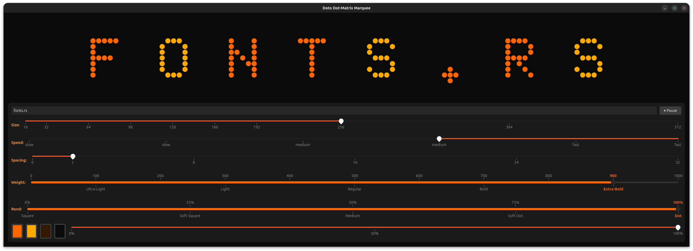

# fonts-rs-doto

Doto dot-matrix variable font integration for GTK 4 and pixel-drawing.

## Overview

[Doto](https://github.com/google/fonts/tree/main/ofl/doto) is a variable
dot-matrix font with two axes: weight (`wght`) and roundness (`ROND`). This
crate integrates Doto into the `fonts-rs` framework, providing GResource
registration, glyph name resolution, and software rendering.



## Features

- **`gtk`** (default) - GResource registration and GTK4 icon name resolution
- **`render`** - Font loading via `ab_glyph` for software rendering
- **`embed-fonts`** - Embed font file via `include_bytes!`
- 25 variant features selecting from the 5x5 weight/roundness matrix

## Usage

```toml
[dependencies]
fonts-rs-doto = "0.1"
# Select a variant:
fonts-rs-doto = { version = "0.1", features = ["bold-dot"] }
```

```rust
use fonts_rs_doto::register_glyphs;
use fonts_rs_doto::GlyphNameExt;
use fonts_rs_doto::DotoName;

fn main() {
    register_glyphs().unwrap();

    let name = DotoName::new("doto-a".to_string());
    if let Some(codepoint) = name.codepoint() {
        println!("U+{:04X}", codepoint as u32);
    }
}
```

## Font License

Doto is licensed under the SIL Open Font License (OFL-1.1). The crate code
is MIT.
